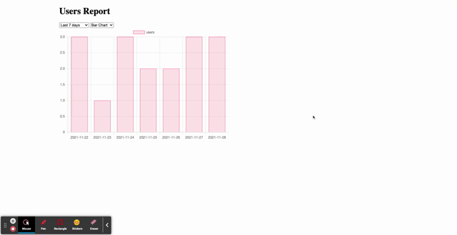

# Laravel And Chart.js

This is demo project using laravel and chart.js.



## Requirements

* PHP >= 7.4

# Installation

Clone the repository:

```
git clone https://github.com/thetminnhtun/laravel-chartjs.git
```

Go to the repo folder:

```
cd laravel-chartjs
```

Install PHP dependencies:

```
composer install
```

Create .env file

```
cp .env.example .env
```

Generate the application key:

```
php artisan key:generate
```

Run the database migration (**Set the database connection in .env before migrating**):

```
php artisan migrate
```

Run database seeder:

```
php artisan db:seed
```

Run the local development server:

```
php artisan serve
```

Open in your browser [http://localhost:8000](http://localhost:8000)

## License

This project is open-sourced software licensed under the [MIT license](https://opensource.org/licenses/MIT).